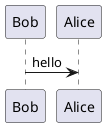

**UML** là một ngôn ngữ cơ bản giúp các nhà *thiết kế phần mềm* có thể ghi lại và truyền đạt những ý tưởng của họ đến các Lập trình viên và Khách hàng của mình. Những hình ảnh được vẽ trong UML sẽ giúp người đọc có thể tưởng tượng phần nào phần mềm sẽ hoạt động thế nào. Nó phổ biến mức các trường chuyên về Công nghệ thông tin chọn nó là môn học cơ bản cho các sinh viên.

Hiện có nhiều công cụ hỗ trợ UML. Bạn có thể vẽ trên *giao diện đồ họa* từ phần mềm cài đặt trên máy tính cá nhân đến vẽ trên các *giao diện web* rất thuận tiện vì không cần cài đặt. Tuy nhiên, nếu bạn là Lập trình viên mà vẽ như một nhà thiết kế *mỹ thuật* thì không có nhiều cảm giác. **PlantUML** sẽ giúp bạn sẽ nó bằng mã. Nó gần giống như các Lập trình viên *HTML* sẽ viết mã để hiện thị lên giao diện web.


# Cài đặt công cụ

Để vẽ UML bằng PlantUML bạn cần có một trình soạn thảo (editor). Nó không qui định trình soạn thảo nào. Bạn có thể dùng *Notepad, Visual Studio Code (VS), Eclipse, Sublime Text...* vì đây chỉ là nơi bạn viết mã thôi. Sau đó PlantUML sẽ dùng trình biên dịch (compiler) của mình để vẽ ra hình ảnh cho bạn.

Visual Studio Code có một *extension* hỗ trợ bạn làm điều này. Nên trong bài này tôi sẽ sử dụng nó để viết. Hãy vào *extension* của VS để cài `PlantUML` và `PlantUML Previewer`. Đây là 2 *extension* giúp bạn viết mã theo PlantUML và hiện thị hình vẽ khi bạn viết.

# Thiết lập trình biên dịch

PlantUML sẽ sử dụng trình biên dịch của mình để vẽ hình. VS nói bạn cần thiết lập cho nó biết nơi để có thể biên dịch. Hiện có 2 cách để biên dịch và hiển thị hình ảnh PlantUML.

## 1. Từ máy tính cá nhân hiện tại

Nếu bạn chọn phương pháp này thì bạn không cần phải có Internet vẫn có thể xuất ra hình ảnh từ mã nguồn của PlantUML. Bạn cần đặt tên tập tin có phần mở rộng là `.puml` (có thể vài phần mở rộng khác cần tham khảo thêm tài liệu của PlantUML). 

Máy tính cá nhân cần cài đặt 2 ứng dụng:
- *Java* (sau khi cài đặt Java bạn cần thiết lập biến môi trường `JAVA_HOME`).
- *Graphviz* (Đựa sử dụng để sinh ra hình ảnh của sequence diagram và activity diagram).

Nếu đã cài đặt xong ở trên bạn có thể vào VS để cấu hình PlantUML. Cần quan tâm đến 2 thiết lập trong VS:

```json
"plantuml.java": "C:\\Programs\\java\\java.exe",     // Path of java.exe
"plantuml.render": "Local"
```

Tuy nhiên nếu bạn cần bản vẽ của mình xuất ra hình đẹp hơn thì có thể tham khảo thêm các tham số thiết của PlantUML trong VS tại đây [https://marketplace.visualstudio.com/items?itemName=jebbs.plantuml](https://marketplace.visualstudio.com/items?itemName=jebbs.plantuml).

Bây giờ có thể viết đoạn mã và xem kết quả trong VS. Tạo tập tin `test.puml` và dán đoạn mã dưới.



Nhấn `Ctr+P` gõ `PlantUML: Preview current diagram` để xem hình ảnh trong màn hình bên cạnh.


Tuy nhiên nếu bạn không dùng VS thì cần tải thêm `plantuml.java` từ PlantUML để có thể viết mã và xuất hình ảnh. [Tải tại đây](https://sourceforge.net/projects/plantuml/). Sau đó về chạy lệnh:

```shell
java -jar plantuml.jar test.puml
```

## 2. Từ máy chủ ở một nơi khác

Tôi thấy với phương pháp này tôi rất thuận tiện để có thể vẽ vì cấu hình rất ích trong VS. Chúng ta cần lưu ý đến 2 tham số thiết lập duy nhất trong `PlantUML`.

```json
"plantuml.server": "http://192.168.1.100:8080",     // server of plantuml
"plantuml.render": "PlantUMLServer"                 // Local or PlantUMLServer
```

PlantUML server yêu cầu bạn cần có server được cài đặt để có thể render ra hình ảnh. `http://192.168.1.100:8080` là nơi mà tôi cài đặt server của mình.

Tôi dựa trên [https://github.com/plantuml/plantuml-server](https://github.com/plantuml/plantuml-server) để cài đặt PlantUML server cho mình. Ở đây bạn có 2 cách cài đặt. Cài từ mã nguồn tải về và chạy bằng `Tomcat` / `Jetty`. Nhưng cách 2 thì đơn giản rất nhiều nếu bạn đã có `Docker`. Tôi sử dụng `Docker` để cài đặt.

```sh
docker run -d -p 8080:8080 plantuml/plantuml-server:jetty
docker run -d -p 8080:8080 plantuml/plantuml-server:tomcat
```

Bạn chỉ cần một trong 2 câu trên để chạy thôi. `Cần phải có Docker Engine được cài đặt trong server` ([tham khảo](https://docs.docker.com/install/linux/docker-ce/ubuntu/)).

Bây giờ đơn giản là chạy URL [http://192.168.1.100:8080](http://192.168.1.100:8080) bạn sẽ thấy giao diện web để có thể vẽ UML trên web.

Do ta đã cấu hình VS trỏ đến máy chủ mà bạn vừa cài đặt PlantUML Server nên hiển nhiên bạn có thể vẽ trong VS và thấy được kết quả. Thử đoạn mã dưới và cảm nhận.


# Tài liệu tham khảo

1. [PlantUML in Visual Studio Code](https://marketplace.visualstudio.com/items?itemName=jebbs.plantuml)
2. [PlantUML Preview in Visual Studio Code](https://marketplace.visualstudio.com/items?itemName=Mebrahtom.plantumlpreviewer)
3. [Github PlatUML Server](https://github.com/plantuml/plantuml-server)
4. [Graphviz Dot](http://plantuml.com/graphviz-dot)
5. [PlantUML.java - Giao diện và Trình biên dịch](https://sourceforge.net/projects/plantuml/)