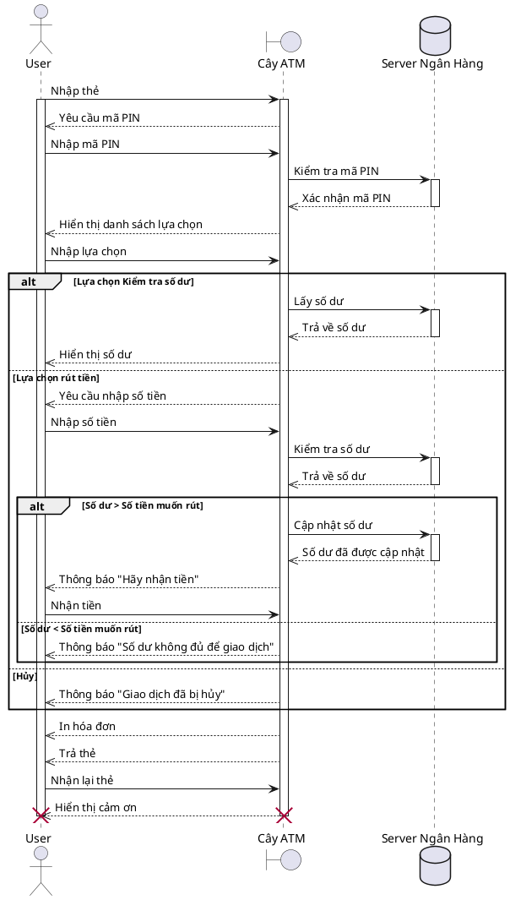

## Tổng quan
Sequence Diagram (biểu đồ tuần tự) mô tả luồng hoạt động một số chức năng quan trọng/phức tạp. Ví dụ chức năng thanh toán, chức năng booking. Với những chức năng phức tạp, với các workflow chồng chéo, việc xây dựng tài liệu Sequence Diagram là rất cần thiết và còn giúp các thành viên mượng tượng rõ ràng hơn về quy trình vận hành, workflow của các chức năng. 

Biểu đồ tuần tự là biểu đồ dùng để xác định các trình tự diễn ra sự kiện của một nhóm đối tượng nào đó. Nó miêu tả chi tiết các thông điệp được gửi và nhận giữa các đối tượng đồng thời cũng chú trọng đến việc trình tự về mặt thời gian gửi và nhận các thông điệp đó. 

## Hướng dẫn
### 1. Các thành phần trong Sequence Diagram
Để hiểu sơ đồ tuần tự (sequence diagram) là gì, trước tiên, chúng ta nên làm quen với các ký hiệu và thành phần của nó. Sơ đồ tuần tự được tạo thành từ các thành phần sau: 

  
| Tên | Kí hiệu (hình vẽ) | Code            |Mô tả | 
| ----- |:----------------------: | --------            |-------- |
| Đối tượng (Object, Class) |  | `@startuml`  `participant User`  `@enduml`| Đại diện cho một lớp (class) hoặc đối tượng (object). Kí hiệu đối tượng cho thấy một đối tượng sẽ hoạt động như thế nào trong bối cảnh của hệ thống.|
| Activation box |  | `@startuml`  `participant User` `participant "First Class" as A` `User -> A: DoWork` `activate A`  `A --> User: Done` `deactivate A`  `@enduml` |Đại diện cho thời gian cần thiết cho một đối tượng để hoàn thành một tác vụ. Nhiệm vụ sẽ nhiều thời gian, activation box càng dài. 
| Actor |  | `@startuml`  `actor User`  `@enduml`  |Hiển thị các thực thể tương tác với hoặc bên ngoài hệ thống.  |
| Lifeline |      | `@startuml`  `participant User`  `@enduml`   `@startuml`  `actor User`  `@enduml`  |Đại diện cho thời gian trôi qua. Hiển thị các sự kiện tuần tự xảy ra với một đối tượng trong tất cả quá trình.  |
| Message | | | Thông điệp giao tiếp giữa các lớp và đối tượng  |
| Synchronous message  |  | `@startuml`  `participant Client` `participant Server`  `Client -> Server`  `@enduml ` | Được sử dụng khi người gửi phải chờ phản hồi thông điệp trước khi có những hành động tiếp theo. Sơ đồ phải hiển thị cả yêu cầu và trả lời. |
| Reply message  |   |  `@startuml`  `participant Client` `participant Server`  `Client <-- Server`  `@enduml ` | Thông điệp trả lời cho những yêu cầu.  |
| Asynchronous message  |  |  `@startuml`  `participant Client` `participant Server`  `Client ->> Server`  `@enduml ` | Không yêu cầu phản hồi trước khi người gửi tiếp tục. |
| Asynchronous return message  |  | `@startuml`  `participant Client` `participant Server`  `Client <<-- Server`  `@enduml ` | Trả lời thông điệp kiểu không đồng bộ.  |
| Create message  |  | `@startuml`  `participant Client` `participant Server`  `Client -> Server: <<createRequest>>` `Server --> Client: Created`  `@enduml` | Thông điệp thông báo tạo một lớp hoặc đối tượng  |
| Delete message  |  | `@startuml`  `participant Client` `participant Server`  `Client -> Server: DoWork` `activate Client` `Server --> Client: WorkDone` `destroy Server` `deactivate Client`  `@enduml`  | Thông điệp thông báo hủy một lớp hoặc đối tượng  |
| Loop  |  | `@startuml`  `participant Client` `participant Server`  `Client ->> Server: report` `loop until reporting Client ends` `Client -->> Server: report` `end loop`  `@enduml`  | Được sử dụng để mô hình hóa các kịch bản if/then tức là, một kịch bản sẽ chỉ xảy ra trong một số điều kiện nhất định. |
| Alternative  | | `@startuml`  `participant Client` `participant Server`  `Client -> Server: Authentication Request` `alt successful case` &emsp;`Server -> Client: Authentication Accepted` `else some kind of failure` &emsp;`Server -> Client: Authentication Failure` `else Another type of failure` &emsp;`Server -> Client: Please repeat` `end`  `@enduml`  | Tượng trưng cho một sự lựa chọn giữa hai hoặc nhiều message.  |
| Group |   | `@startuml`  `participant Client` `participant Server`  `group Working` &emsp;`Client -> Server: DoWork` &emsp;`activate Client` &emsp;`Server --> Client: WorkDone` &emsp;`destroy Server` &emsp;`deactivate Client` `end`  `@enduml` | Gom nhóm các messages hoặc box  |

### 2. Cách thiết kế Sequence Diagram với PlantUML
Sau khi đã làm quen với các kí hiệu và cách thức sử dụng chúng, chúng ta sẽ đi vào xây dựng một Sequence Diagram với PlanUML bằng một ví dụ cụ thể là chức năng rút tiền ở cây ATM.

__Step 1:__ Xác định các chức năng cần thiết kế  
- Dựa vào Use Case Diagram / User Story hay Requirement mà lựa chọn chức năng để thiết kế. 
___Chú ý:___ mỗi chức năng là một Sequence Diagram riêng biệt. 

__Step 2:__ Xác định các bước để thực hiện 
- Người dùng nhập đưa thẻ vào cây ATM 
- Người dùng nhập mã pin và hệ thống kiểm tra mã pin 
- Nếu sai thì thông báo cho người dùng, ngược lại thì hiển thị danh sách chức năng (Kiểm tra số dư, rút tiền) 
- Với trường hợp kiểm tra số dư, hệ thống lấy thông tin số dư và trả về thông tin số dư cho người dùng 
- Với trường hợp rút tiền, sẽ có 2 trường hợp xảy ra: đủ số dư để rút và không đủ số dư để rút 
- In hoá đơn, trả thẻ, xác nhận người dùng nhận lại thẻ khi kết thúc quá trình giao dịch 

__Step 3:__ Xác định đối tượng tham gia 
- Actor thể hiện người dùng 
- Cây ATM là phương tiện giao tiếp giữ người dùng và server 
- Server là nơi lưu trữ và xử lý yêu cầu (có thể tách xử lý yêu cầu ra thành một cotrol riêng biệt) 

__Sơ đồ kết quả:__

__Source code:__

## Tạm kết 
Sequence Diagram là bản vẽ để xác định các đối tượng cũng như tuần tự các bước để thực hiện một bài toán, một chương trình. Sequence Diagram được dùng để thiết kế phát triển và test các chức năng. 
## Tài liệu tham khảo
Tài liệu tham khảo về công cụ PlantUML: https://plantuml.com/ 

https://plantuml.com/sequence-diagram